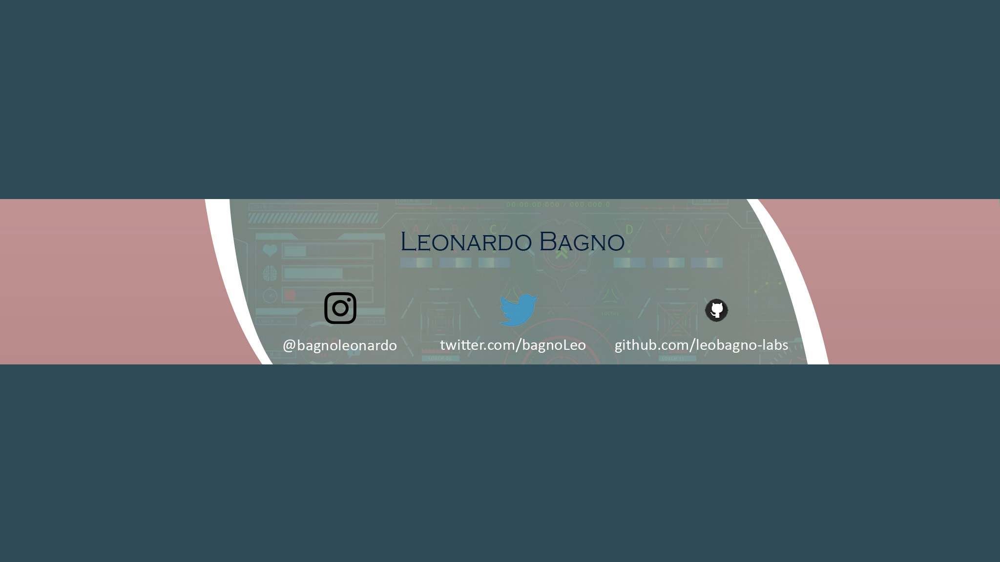

##  **World Cup 2022** &copy;FIFATM
<h3 align="center">Good Morning, Good Afternoon, Good Night. My name is Leonardo Bagno.</h3>
<h5 align="center">A passionate frontend developer from Brazil.Iamcurrently learning *C#, Javascript, Java, SQL Server, Php, Android*</h5>
-🎯 How to reach me **bagnoleonardo@gmail.com**
 

- First Match: Monday, Nov. 21, 2022
- World Cup Final: Sunday, Dec. 18, 2022   
  
Eight stadiums will hold the event across five cities including: Al Rayyan, Al Wakrah, Al Khor, Lusall and Doha.  

### **TICKETS!!** 

Where to purchase for tickets:  
[#FIFA](https://www.fifa.com/fifaplus/en/tickets)

Group Stage Draw

| Group A     | Group B | Group C      | Group D   | Group E    | Group F | Group G     | Group H     |
| ----------- | ------- | ------------ | --------- | ---------- | ------- | ----------- | ----------- |
| Qatar       | England | Argentina    | France    | Spain      | Belgium | Brazil      | Portugal    |
| Senegal     | Iran    | Saudi Arabia | Australia | Costa Rica | Canada  | Serbia      | Ghana       |
| Ecuador     | USA     | Mexico       | Denmark   | Germany    | Morroco | Switzerland | Uruguay     |
| Netherlands | Wales   | Poland       | Tunisia   | Japan      | Croatia | Cameroon    | South Korea |

 
  
 
 <h3 align="left">Languages and Tools:</h3>

          <a href="https://www.w3.org/html/" target="_blank" rel="noreferrer">href="https://www.python.org" target="_blank" rel="noreferrer">  </a>        

#### Under Construction 😋

